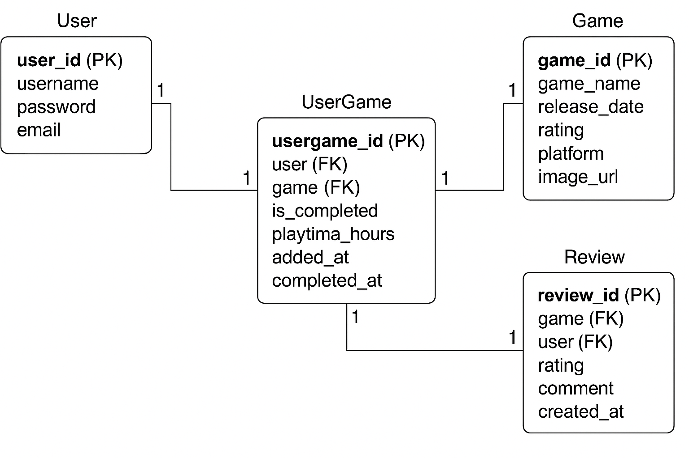

# 🎮 Checkpoint - Capstone Project

## User Story

As a user, I want to add the games I play to my personal list and track whether I have completed them or not, including the playtime, so I can monitor my progress easily. I also want to rate and review the games and see other users' reviews.

---

## ERD - Entity Relationship Diagram

The following diagram shows the main database structure for **Checkpoint**, including the relationships between users, games, user progress, and reviews.

> 📌 **Insert your ERD image below by replacing `Diagram.png`**



---

## API Endpoints

### User
| HTTP Verb | Path           | Action   | Description                |
|-----------|----------------|----------|----------------------------|
| POST      | /register       | create   | Register new user          |
| POST      | /login          | create   | Login user                 |
| GET       | /user/:id/games | index    | Get user's games list      |

---

### Game
| HTTP Verb | Path          | Action   | Description               |
|-----------|---------------|----------|---------------------------|
| GET       | /games        | index    | List all games            |
| GET       | /games/:id    | show     | Show single game          |
| POST      | /games        | create   | Add a new game            |
| PUT       | /games/:id    | update   | Update game information   |
| DELETE    | /games/:id    | destroy  | Delete a game             |

---

### UserGame
| HTTP Verb | Path                     | Action   | Description                       |
|-----------|--------------------------|----------|-----------------------------------|
| POST      | /usergame                | create   | Add game to user's list           |
| PUT       | /usergame/:id            | update   | Update playtime or completion     |
| DELETE    | /usergame/:id            | destroy  | Remove game from user's list      |

---

### Reviews
| HTTP Verb | Path              | Action   | Description               |
|-----------|-------------------|----------|---------------------------|
| POST      | /games/:id/review | create   | Add a review to a game     |
| GET       | /games/:id/review | index    | Get reviews for a game     |

---

## 🛠️ Technologies Used

- Python
- Django & Django REST Framework
- PostgreSQL
- JWT Authentication
- Docker
- RAWG API (for game search)
- React (Frontend - not shown here)

---

## 🚀 How to Run the Project (Backend)

1. **Clone the repository:**
   ```bash
   git clone https://github.com/mohammed-alhashim99/Checkpoint_Backend.git
   cd Checkpoint_Backend
   ```

2. **Create and activate a virtual environment:**
   ```bash
   python -m venv venv
   source venv/bin/activate  # On Windows use: venv\Scripts\activate
   ```

3. **Install dependencies:**
   ```bash
   pip install -r requirements.txt
   ```

4. **Set up your `.env` file** with your database and secret settings.

5. **Apply migrations:**
   ```bash
   python manage.py makemigrations
   python manage.py migrate
   ```

6. **Run the server:**
   ```bash
   python manage.py runserver
   ```

7. **Visit the API in the browser:**
   ```
   http://localhost:8000
   ```

---

## 🧊 Ice Box Features

- Dark mode toggle
- Game recommendation system
- Leaderboard for most active users
